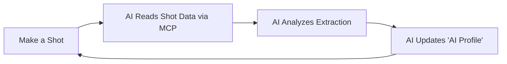

# Gaggimate MCP Server

MCP server for Gaggimate espresso machine profiles with AI-powered profile optimization. 

Blogpost: https://archestra.ai/blog/brew-by-ai

## Overview

This MCP server enables an AI feedback loop for perfecting espresso extraction. The AI can read shot history, analyze extraction data, and update the "AI Profile" to continuously improve your espresso shots. This actually works and allows the machine to automatically tune itself to new coffee beans!

### AI Optimization Loop



The process:
1. **Make a shot** - Brew espresso using the current AI Profile
2. **AI analyzes the shot data** - Read temperature curves, pressure profiles, and extraction metrics via MCP
3. **AI updates the "AI Profile"** - Adjust parameters based on the analysis (temperature, pressure, flow, timing)
4. **Repeat** - Next shot uses the improved profile

## Quick Start

```bash
GAGGIMATE_HOST=192.168.1.100 npx -y matvey-kuk/gaggimate-mcp
```

## Environment Variables

- `GAGGIMATE_HOST`: Device hostname (default: `localhost`)
- `GAGGIMATE_PROTOCOL`: WebSocket protocol `ws` or `wss` (default: `ws`)

## Tools

- `list_profiles`: List all brewing profiles
- `get_profile`: Get a specific profile by ID
- `update_ai_profile`: Update or create the AI Profile for espresso brewing (supports adaptive extraction with stop conditions). This tool can't update other profiles to avoid corrupting them!
- `list_shot_history`: List brewing history (with optional limit/offset)
- `get_shot`: Get detailed information about a specific shot by ID

## Docker

```bash
# Build
npm run build
docker build -t gaggimate-mcp .

# Run with default settings
docker run gaggimate-mcp

# Run with custom host
docker run -e GAGGIMATE_HOST=192.168.1.100 gaggimate-mcp
```
